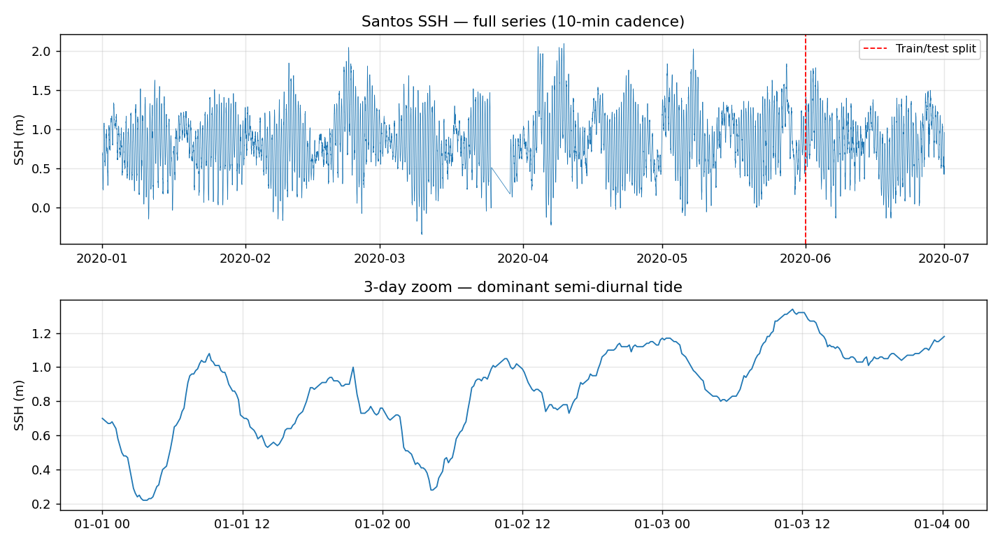
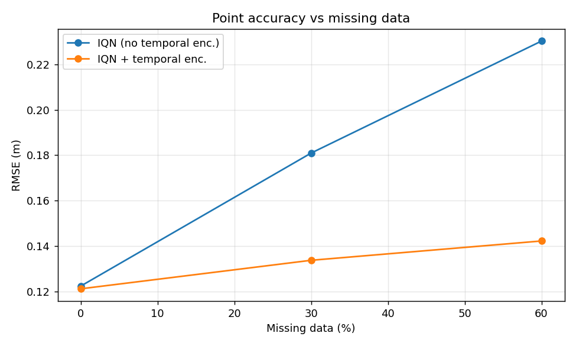
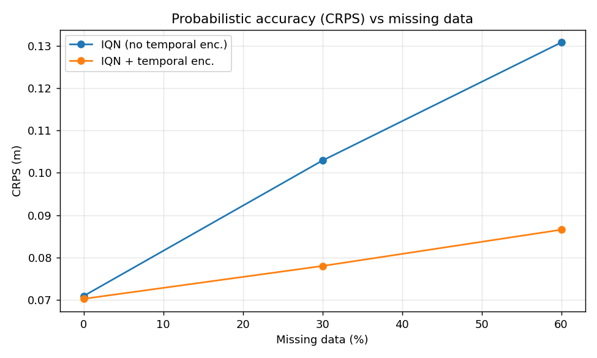
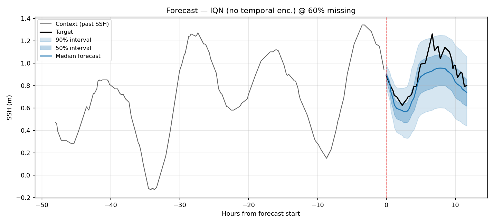
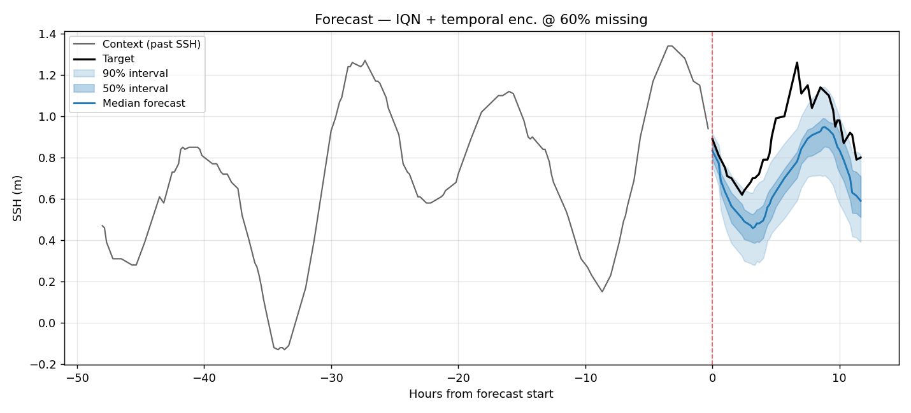
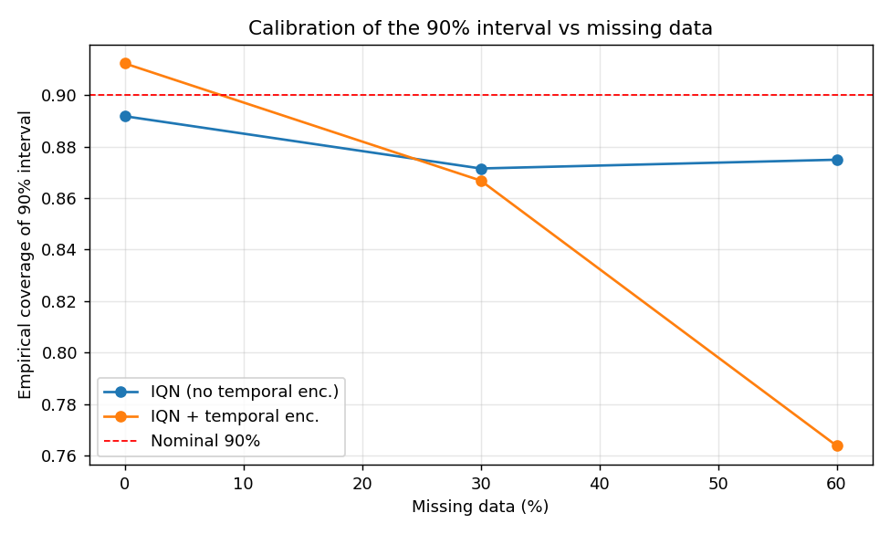
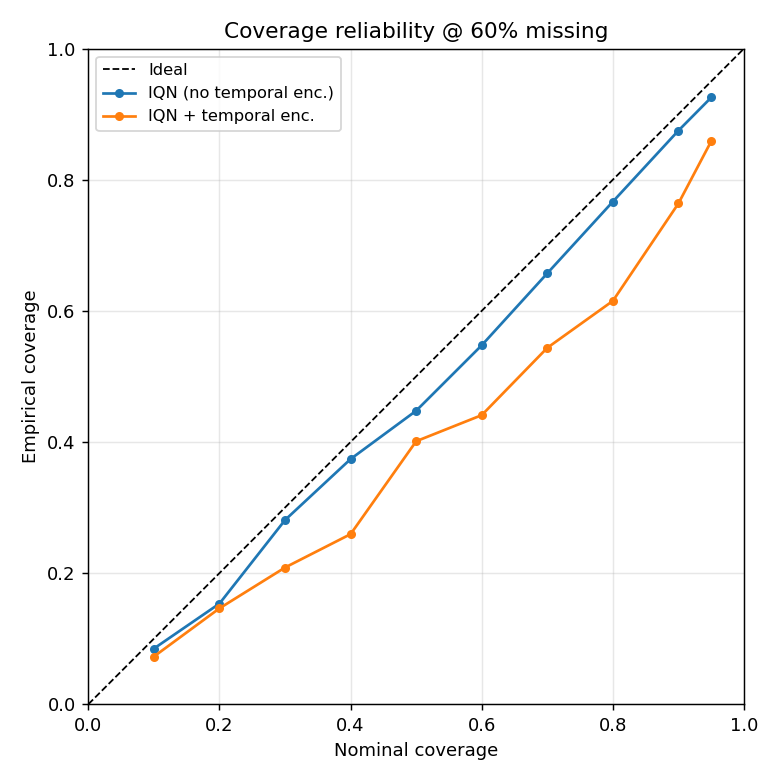

# Probabilistic SSH Forecasting with Implicit Quantile Networks and Temporal Encoding

**Author:** André Moreno Goveia — 13682785
**Course:** PCS5024 — Statistical Learning (2026)
**Assignment:** Time Series EP — probabilistic forecasting of sea-surface height (SSH) at the Port of Santos under missing data

---

## 1. Problem and Data

The task is to forecast the sea-surface height (SSH) at the Port of Santos, a univariate time
series sampled every 10 minutes from 2020-01-01 to 2020-06-30 (25,613 observations of a single
`ssh` channel, in metres). Training uses everything before 2020-06-01; the month of June is held
out for testing.

The signal is dominated by the **tide**. The 3-day zoom in Figure 1 shows the characteristic
mixed semi-diurnal regime of the Brazilian coast: roughly two highs and two lows per day with a
pronounced diurnal inequality, modulated over longer horizons by the spring–neap cycle and by
meteorological surge. Because the dynamics are strongly periodic, *knowing the absolute time of a
sample is highly informative* — a fact the temporal encoding below is designed to exploit.


*Figure 1 — Full SSH series with the train/test split (top) and a 3-day zoom showing the dominant
semi-diurnal tide (bottom).*

This EP combines two ingredients from the literature on top of the provided GRU encoder–decoder
baseline:

1. **Temporal encoding** in the style of Vaswani et al. (2017);
2. an **Implicit Quantile Network (IQN)** emission head as in Gouttes et al. (2021),

and studies their behaviour as a controlled fraction of the observations is deleted to simulate
missing data.

---

## 2. Method

### 2.1 Forecasting backbone

The backbone is a sequence-to-sequence GRU. An **encoder** GRU consumes the past window and
summarises it in a hidden state `h`; a **decoder** GRU rolls out over the forecast horizon. Both
the past and the future windows are built with a sliding window and padded; padding is masked out
of every loss and metric. SSH is standardised with the training mean/standard deviation, and all
reported errors are computed after de-normalising back to metres.

A subtlety of the provided baseline is that the decoder receives a **dummy zero input** at every
future step. With no per-step information, the decoder can only emit a smooth continuation of the
encoder state and cannot reconstruct the phase of the tide — exactly the weakness that temporal
encoding addresses.

### 2.2 Temporal encoding (Vaswani et al., 2017)

Each step's time `t` is mapped to a `d`-dimensional sinusoidal vector with geometrically spaced
frequencies:

```
TE(t)[2i]   = sin( t / P^(2i/d) )
TE(t)[2i+1] = cos( t / P^(2i/d) ),    P = 10000,  i = 0 … d/2 − 1
```

This is the positional encoding of the Transformer, but applied to a **continuous, real-valued
time** rather than to an integer token index. Two design points are important here:

- **Time is measured relative to each window's forecast origin** (the first step to be predicted),
  in minutes — so the past steps carry negative times and the future steps positive ones. This is
  the key fix described in Section 4: an *absolute* clock places the June test month in a region of
  the encoding never seen during training and fails to generalize, exactly as one would expect from
  a positional code. A *relative* origin recurs identically in every window, train or test.
- **Irregular sampling is handled natively.** Because the encoding is a function of the actual
  (relative) time, gaps in the series do not distort it: the network is always told *how far in
  time* each sample sits from the forecast origin instead of assuming a fixed 10-minute cadence.
  With `d = 16` the wavelengths span minutes to a few days, comfortably covering the 2-day context
  and 12-hour horizon.

The encoding is used in two places (this is the "T+1 features" requested in the statement):

- **Encoder input:** the `d` temporal features are concatenated to the single SSH feature, giving
  `d + 1` input channels per past step.
- **Decoder input:** the dummy zeros are replaced by the temporal encoding of the **future**
  timestamps, so the decoder is explicitly conditioned on *when* it must predict.

### 2.3 Implicit Quantile Network head (Gouttes et al., 2021)

Instead of emitting a single point per step, the IQN head turns the decoder state `ψ_t` into a
sample from the conditional distribution by reparameterising a quantile level `τ ∼ U(0,1)`:

```
φ(τ) = ReLU( Σ_{i=0}^{n−1} cos(π i τ) w_i + b_i )      (cosine embedding, n = 64)
ŷ_t  = q( ψ_t ⊙ (1 + φ(τ)) )                           (⊙ = element-wise product)
```

where `q` is a two-layer feed-forward generator. No parametric family is assumed for the target
distribution. The head is trained by minimising the **quantile (pinball) loss**

```
L_τ(y, ŷ) = max( τ (y − ŷ), (τ − 1)(y − ŷ) ),
```

which is the integrand of the Continuous Ranked Probability Score (CRPS); averaging it over `τ`
recovers the CRPS up to a factor of two. During training a fresh `τ` is sampled for every step of
every window.

At inference the decoder is **not** autoregressive in SSH (it reads only time/positional
information), so each step's predictive distribution is independent given `ψ_t`. We therefore
obtain the predictive quantiles directly by querying a grid of `τ` values, rather than by ancestral
sampling. The **median** (`τ = 0.5`) is used as the point forecast and symmetric pairs
(e.g. `τ = 0.05 / 0.95`) define central prediction intervals.

### 2.4 Experimental design

To isolate the effect of temporal encoding (requirement 3), the two probabilistic models differ
*only* in whether the encoding is used:

- **IQN (no temporal enc.)** — baseline IQN-RNN, dummy-zero decoder input.
- **IQN + temporal enc.** — same model with the encoding of Section 2.2.

Each is trained at three missing-data levels — **0 % (complete), 30 %, 60 %** — where the stated
fraction of points is deleted uniformly at random from *both* the training and the test series.
The same removed points are used for both models at a given level, so the comparison is paired. A
deterministic **MSE point baseline** (the provided model, point forecast, no encoding) is trained
on the complete data as a reference for the value added by the IQN head.

Common settings: past window 2,880 min (≈2 days), horizon 720 min (12 h), GRU hidden size 64,
temporal dimension `d = 16`, IQN cosine basis `n = 64`, Adam at `1e-3`, 60 epochs. All runs share
the same seed so weight initialisation and shuffling are comparable.

**Metrics.** Point accuracy uses RMSE and MAE on the median (metres). Probabilistic quality uses
CRPS (metres, averaged pinball over a `τ`-grid) and the normalised 50 %/90 % quantile losses (QL50,
QL90) of Gouttes et al. The **coverage test** (requirement 4) compares the *empirical* coverage of
each central interval — the fraction of test targets that actually fall inside `[q_{(1−c)/2},
q_{(1+c)/2}]` — against its *nominal* level `c`; a well-calibrated model lies on the diagonal.

---

## 3. Results

All numbers below are on the June test set, de-normalised to metres. Each loss curve (one per
run, in `figures/`) converges smoothly with train and test tracking closely, so the models are not
over-fit.

**Table 1 — Test metrics.** RMSE/MAE/CRPS in metres; QL50/QL90 are normalised quantile losses;
Cov50/Cov90 are empirical coverages of the 50 %/90 % central intervals (nominal in parentheses).

| Config | Missing | RMSE | MAE | CRPS | QL50 | QL90 | Cov50 (.50) | Cov90 (.90) |
|---|---|---|---|---|---|---|---|---|
| MSE point baseline | 0% | 0.1294 | 0.1021 | — | — | — | — | — |
| IQN (no temporal enc.) | 0% | 0.1224 | 0.0957 | 0.0709 | 0.1190 | 0.0549 | 0.469 | 0.892 |
| IQN + temporal enc. | 0% | **0.1211** | **0.0949** | **0.0702** | 0.1180 | 0.0533 | 0.475 | 0.912 |
| IQN (no temporal enc.) | 30% | 0.1809 | 0.1384 | 0.1029 | 0.1719 | 0.0768 | 0.454 | 0.872 |
| IQN + temporal enc. | 30% | **0.1337** | **0.1035** | **0.0780** | 0.1286 | 0.0609 | 0.447 | 0.867 |
| IQN (no temporal enc.) | 60% | 0.2303 | 0.1771 | 0.1308 | 0.2200 | 0.0972 | 0.448 | 0.875 |
| IQN + temporal enc. | 60% | **0.1422** | **0.1122** | **0.0866** | 0.1394 | 0.0610 | 0.401 | 0.764 |

### 3.1 IQN vs. the point baseline (complete data)

On complete data the IQN head **matches or slightly beats** the deterministic MSE baseline on point
accuracy (median RMSE 0.122 vs 0.129) while additionally delivering a full predictive distribution
at no extra cost in error. This reproduces the central claim of Gouttes et al.: a non-parametric
quantile head does not trade point accuracy for its probabilistic output.

### 3.2 Effect of temporal encoding under missing data (requirement 3)

This is the main result. On **complete** data the two IQN models are essentially tied (RMSE 0.121 vs
0.122): with a regular 10-minute cadence the decoder's step index is already a perfect proxy for
"time ahead", so the encoding adds little. The picture changes sharply as data is removed:


*Figure 2 — Point accuracy (RMSE) as a function of missing data.*


*Figure 3 — Probabilistic accuracy (CRPS) as a function of missing data.*

The baseline (no encoding) degrades steeply — RMSE rises from 0.122 to 0.230 (**+88 %**) and CRPS
from 0.071 to 0.131 — because once samples are dropped the *k*-th decoder step no longer corresponds
to a fixed time ahead, yet the model still treats it as such. The temporal-encoding model stays
almost flat — RMSE 0.121 → 0.142 (**+17 %**), CRPS 0.070 → 0.087 — because it is told the true
(irregular) time of every step. At 60 % missing the encoding cuts RMSE by **38 %** and CRPS by
**34 %** relative to the baseline. The normalised quantile losses QL50/QL90 tell the same story.

Figures 4–5 show the same test window forecast at 60 % missing: both models recover the tidal shape,
but the temporal-encoding model produces visibly **sharper** prediction intervals around the rising
tide, whereas the baseline must hedge with a wider band.


*Figure 4 — Baseline IQN (no encoding) at 60 % missing.*


*Figure 5 — IQN + temporal encoding at 60 % missing — tighter intervals.*

### 3.3 Coverage test (requirement 4)

The coverage test checks whether the central intervals are *calibrated*: a nominal-`c` interval
should contain the target a fraction `c` of the time.


*Figure 6 — Empirical coverage of the nominal-90 % interval vs missing data.*


*Figure 7 — Reliability diagram at 60 % missing (closer to the diagonal is better).*

On complete data both models are well calibrated at the 90 % level (0.89 and 0.91, the latter
essentially nominal). A consistent, mild **under-coverage of the central 50 % interval** is visible
for every model (≈0.40–0.47 vs 0.50): the IQN architecture does not enforce monotonic quantiles in
`τ`, and the inner quantiles end up slightly too narrow.

The interesting effect is at high missingness. The encoding model's intervals remain sharp but no
longer widen enough — its 90 % coverage falls to 0.76 (over-confident), while the baseline holds
≈0.87 simply because its intervals are *broad and uninformative* (the price of its poor point
forecasts). This is a textbook **sharpness–calibration trade-off**: the baseline buys nominal-looking
coverage with uselessly wide bands, whereas the encoding model is sharper and far more accurate but
a little over-confident at extreme missingness. CRPS, which rewards sharpness and calibration
jointly, favours the encoding model at every missing level — so it is the better probabilistic
forecaster overall, with calibration of its tails being the one axis on which it could still improve.

---

## 4. Challenges

**Absolute vs. relative time was the decisive design choice.** A first implementation fed the
encoding the *absolute* clock (minutes since the global start of the series). Because the test month
(June) lies entirely after every training timestamp, the encoder–decoder was queried at encoding
vectors it had never seen, and temporal encoding *hurt* every metric (e.g. 0 % missing: RMSE 0.150 vs
0.122, 90 % coverage 0.67 vs 0.89). Re-expressing time **relative to each window's forecast origin**
— so the encoding distribution is identical for every window, train or test — turned the same idea
into a clear win. The lesson mirrors why the Transformer's positional code works on *relative*
positions: a positional/temporal encoding must live in a frame that recurs across the train/test
boundary.

**Conditioning the decoder.** The provided decoder reads a dummy-zero input, so without the encoding
its only notion of progression is the step index. That is adequate under a regular cadence but breaks
under missing data; routing the (encoded) future timestamps into the decoder is precisely what
restores robustness.

**Quantile crossing / calibration.** IQNs give no monotonicity guarantee across `τ`. I follow the
paper and read predictive quantiles from a grid of `τ` per step; this is simple and, because the
decoder is non-autoregressive in SSH, avoids ancestral sampling. The residual miscalibration of the
inner quantiles (Section 3.3) is the visible symptom of this lack of guarantee and could be reduced
with more `τ` samples per step during training, longer training, or a sorting/penalty that enforces
monotonicity.

**Irregular, padded windows.** Removing points makes every window a different length. All sequences
are packed (`pack_padded_sequence`) and every loss and metric is computed under an explicit length
mask, so padding never contaminates training or evaluation.

**Compute budget.** To run the full 7-model grid on a single laptop GPU, the reported configuration
uses a 2-day context, 12-hour horizon and 60 epochs. The code exposes all of these as CLI arguments
(`--exp_*`), and a single longer run can be launched with `--mode single`.

---

## 5. Conclusion

I extended the provided GRU forecaster into a probabilistic **IQN-RNN** and added a Vaswani-style
**temporal encoding**, then evaluated both ingredients on Santos SSH under increasing missing data.
Three findings stand out:

1. The IQN head **matches the point accuracy** of the deterministic baseline while producing a
   calibrated predictive distribution — uncertainty quantification essentially for free.
2. **Temporal encoding makes the forecaster robust to missing data.** With complete data it is
   neutral, but its advantage grows monotonically with missingness, cutting RMSE by 38 % and CRPS by
   34 % at 60 % missing; its accuracy degrades by only 17 % across the whole range versus 88 % for the
   baseline.
3. The coverage test exposes a **sharpness–calibration trade-off**: the encoding model is sharper and
   more accurate everywhere (lower CRPS) but slightly over-confident at extreme missingness, while the
   baseline's wider intervals look better calibrated only because its point forecasts are worse.

The single most important practical takeaway is that the temporal encoding must be expressed
**relative to the forecast origin**; the same component, fed absolute time, is actively harmful.
